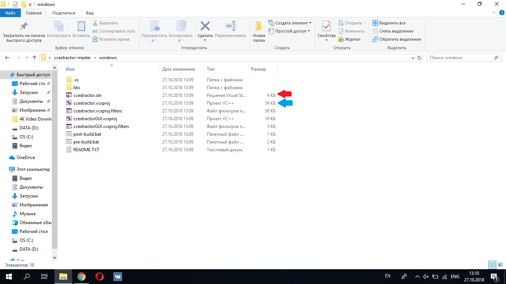
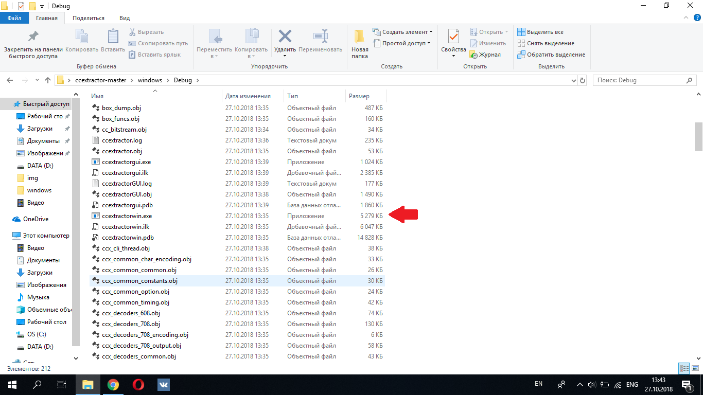

# Compiling CCExtractor

You may compile CCExtractor across all major platforms using `CMakeLists.txt` stored under `ccextractor/src/` directory. Autoconf and custom build scripts are also available. See platform specific instructions in the below sections.

Downloads for precompiled binaries and source code can be found [on our website](https://www.ccextractor.org?id=public:general:downloads).

Clone the latest repository from Github

```bash
git clone https://github.com/CCExtractor/ccextractor.git
```

## Linux

1. Make sure all the dependencies are met.

Debian:

```bash
sudo apt-get install -y libglew-dev libglfw3-dev cmake gcc libcurl4-gnutls-dev tesseract-ocr libtesseract-dev libleptonica-dev clang libclang-dev
```

RHEL:

```bash
yum install -y glew-devel glfw-devel cmake gcc libcurl-devel tesseract-devel leptonica-devel clang
```

Arch:
```bash
sudo paru -S glew glfw curl tesseract leptonica cmake gcc clang
```

Rust 1.54 or above is also required. [Install Rust](https://www.rust-lang.org/tools/install). Check specific compilation methods below, on how to compile without rust.

**Note:** On Ubuntu Version 18.04 (Bionic) and later, `libtesseract-dev` is installed rather than `tesseract-ocr-dev`, which does not exist anymore.

**Note:** On Ubuntu Version 14.04 (Trusty) and earlier, you should build leptonica and tesseract from source

2. Compiling

### Using the build script

By default build script does not include debugging information hence, you cannot debug the executable produced (i.e. `./ccextractor`) on a debugger. To include debugging information, use the `builddebug` script.

```bash
# navigate to linux directory and call the build script

cd ccextractor/linux

# compile without debug flags
./build

# compile without rust
./build -without-rust

# compile with debug info
./build -debug            # same as ./build_debug

# compile with hardsubx
[Optional] You need to set these environment variables correctly according to your machine,
     FFMPEG_INCLUDE_DIR=/usr/include 
     FFMPEG_PKG_CONFIG_PATH=/usr/lib/pkgconfig

./build -hardsubx         # same as ./build_hardsubx

# compile in debug mode without rust
./build -debug -without-rust

# test your build
./ccextractor
```

### Standard linux compilation through Autoconf scripts

```bash
sudo apt-get install autoconf  # dependency to generate configuration script
cd ccextractor/linux
./autogen.sh
./configure                    # OR ./configure --without-rust
make

# test your build
./ccextractor

# make build systemwide
sudo make install
```

### Using CMake

```bash
# create and navigate to directory where you want to store built files
cd ccextractor/
mkdir build
cd build

# generate makefile using cmake and then compile
cmake ../src/  # options here
make

# test your build
./ccextractor

# make build systemwide
sudo make install
```

`cmake` also accepts the options:
     `-DWITH_OCR=ON` to enable OCR
     `-DWITHOUT_RUST=ON` to disable rust.
     `-DWITH_HARDSUBX=ON` to enable burned-in subtitles
     
([OPTIONAL] For hardsubx, you also need to set these environment variables correctly according to your machine)

     FFMPEG_INCLUDE_DIR=/usr/include 
     FFMPEG_PKG_CONFIG_PATH=/usr/lib/pkgconfig

### Compiling with GUI

The GUI for CCExtractor has been moved to a separate repository ([https://github.com/CCExtractor/ccextractorfluttergui](https://github.com/CCExtractor/ccextractorfluttergui)).

## macOS

1. Make sure all the dependencies are met. Decide if you want OCR; if so, you'll need to install tesseract and leptonica.
Dependencies can be installed via Homebrew as:

```bash
brew install pkg-config
brew install autoconf automake libtool
# optional if you want OCR:
brew install tesseract
brew install leptonica
```

If configuring OCR, use pkg-config to verify tesseract and leptonica dependencies, e.g.

```bash
pkg-config --exists --print-errors tesseract
pkg-config --exists --print-errors lept
```

### Compiling

#### Using build.command script:

```bash
cd ccextractor/mac
./build.command  #   OR ./build.command OCR

# test your build
./ccextractor
```

#### Using CMake

```bash
# create and navigate to directory where you want to store built files
cd ccextractor/
mkdir build
cd build

# generate makefile using cmake and then compile
cmake ../src/  # options here
make

# test your build
./ccextractor
```

`cmake` also accepts the options:
     `-DWITH_OCR=ON` to enable OCR
     `-DWITHOUT_RUST=ON` to disable rust.
     `-DWITH_HARDSUBX=ON` to enable burned-in subtitles

#### Standard compilation through Autoconf scripts:

```bash
cd ccextractor/mac
./autogen.sh
./configure         # OR ./configure --without-rust
make

# test your build
./ccextractor
```

#### Compiling with GUI:

The GUI for CCExtractor has been moved to a separate repository ([https://github.com/CCExtractor/ccextractorfluttergui](https://github.com/CCExtractor/ccextractorfluttergui)).

## Windows
Dependencies are clang and rust. To enable OCR, rust i686-pc-windows-msvc target should be installed 

Other dependencies are required through vcpkg, so you can follow below steps:
1. Download vcpkg (prefer version `2023.02.24` as it is supported)
2. Integrate vcpkg into your system, run the below command in the downloaded vcpkg folder:
     ```
     vcpkg integrate install
     ```
3. Set Environment Variable for Vcpkg triplet, you can choose between x86 or x64 based on your system.
     ```
     setx VCPKG_DEFAULT_TRIPLET "x64-windows-static-md"
     ```
4. Install dependencies from vcpkg

     In this step we are using `x64-windows-static-md` triplet, but you will have to use the triplet you set in Step 3

     if building Debug-Full, Release-Full (HardSubx)
     ```
     vcpkg install ffmpeg leptonica tesseract --triplet x64-windows-static-md
     ```
     otherwise if you have Debug, Release
     ```
     vcpkg install libpng --triplet x64-windows-static-md
     ```

Note: Following screenshots and steps are based on Visual Studio 2017, but they should be more or less same for other versions.

1.Open `windows/` directory to locate `ccextractor.vcxproj`,  `ccextractorGUI.vcxproj` (blue arrows) and `ccextractor.sln` (red arrow).



2.Accept the security prompt (if any), to proceed with compilation.


3.Using Visual Studio (2015 or above), open ccextractor.sln. This will build both CCExtractor and its GUI. To build them separately, open the respective .vcxproj file.

4.In Solution Explorer, you'll see two projects with the VS version and Windows release version in parenthesis.  Change them to parameters which are true for you by clicking right mouse button on project and selecting properties.


5.Right click and select `build` to compile the project and generate executable file.


6.Find the executable file in `Debug` or `Release` folder, based on selected configuration.



Configurations options are: `(Debug|Release)-Full`

Configurations options include dependent libraries which are used for OCR.

### Using CMake

You may also generate `.sln` files for Visual Studio and build using build tools, or open `.sln` files using Visual Studio.

```bash
cmake ../src/ -G "Visual Studio 14 2015"
cmake --build . --config Release --ccextractor
```

### Using MSBuild

Run the following command in `windows/` directory

```bash
msbuild ccextractor.sln /p:Configuration=Release /p:Platform=x64
```
Different configuration options are,

| Configuration | Platform | Rust target required |
| ------------- |:-------------:| -----:|
| Release | x64 | default |
| Debug | x64 | default |
| Release-Full(OCR) | Win32 | i686-pc-windows-msvc |
| Debug-Full(OCR) | Win32 | i686-pc-windows-msvc |

## Building Installation Packages

### Arch Linux

Go to the package_creators folder using `cd` and run the `./arch.sh`

### Redhat Package Manager (rpm) based Linux Distributions

Go to the package_creators folder using `cd` and run the `./rpm.sh`
