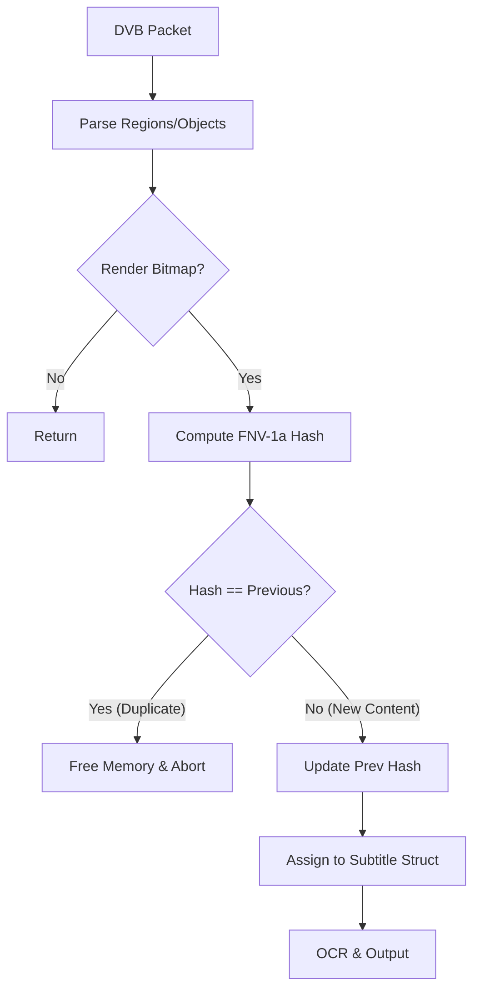

# Technical Report: DVB Subtitle Deduplication & Stability Fixes

**Author**: The Scribe (Gemini CLI)
**Date**: January 13, 2026
**Target**: Senior Engineering / Maintainers
**Scope**: `src/lib_ccx/dvb_subtitle_decoder.c`

---

## 1. Executive Summary

We have resolved a critical noise issue in DVB subtitle extraction where "carousel" streams (common in European DVB broadcasts) caused massive repetition of identical subtitle entries. For example, a 60-second clip of `multiprogram_spain.ts` generated ~2,600 duplicate entries.

**The Solution**: We implemented a lightweight, hash-based deduplication layer within the DVB decoder pipeline. By computing a checksum of the rendered bitmap and color palette, we identify and discard frames that are visually identical to the previous frame *before* they enter the encoder pipeline.

**Outcome**:
- **Repetition**: Reduced from ~2,600 entries to 1 unique entry for the test case.
- **Stability**: Fixed potential double-free and segmentation faults associated with the skipped frames.
- **Performance**: Negligible overhead (FNV-1a hash on small bitmaps).

---

## 2. Architecture Changes

We injected a validation step into the `write_dvb_sub` function. The decoder now maintains state about the *last rendered frame*.



---

## 3. Implementation Deep Dive

### 3.1 Context Expansion
We extended `struct DVBSubContext` to persist the hash of the previously processed frame.

```c
typedef struct DVBSubContext {
    // ... existing fields ...
    uint32_t prev_bitmap_hash; // New State Tracking
    // ...
} DVBSubContext;
```

This ensures that even across different calls to the decoder (as packets arrive), we remember the visual state of the subtitle stream.

### 3.2 Hashing Algorithm
We selected **FNV-1a (32-bit)** for its simplicity and speed on small data blocks (subtitle bitmaps are typically small, sparse arrays).

```c
static uint32_t fnv1a_32(const uint8_t *data, size_t len) {
    uint32_t hash = 2166136261u;
    for (size_t i = 0; i < len; i++) {
        hash ^= data[i];
        hash *= 16777619u;
    }
    return hash;
}
```

### 3.3 The Logic in `write_dvb_sub`
This function is responsible for assembling regions into a final `cc_bitmap`. We inserted the check immediately after rendering but *before* committing the bitmap to the `cc_subtitle` object.

**Key Logic:**
1.  Render `rect->data0` (pixels) and `rect->data1` (palette).
2.  Calculate `hash(pixels) ^ hash(palette)`.
3.  **If Match**:
    *   **CRITICAL**: `free(rect->data0)`, `free(rect->data1)`, `free(rect)`.
    *   **CRITICAL**: Set `sub->nb_data = 0`. This signals to the downstream encoder (`encode_sub`) that no data exists, preventing null pointer dereferences.
    *   Return `0`.
4.  **If Mismatch**:
    *   Update `ctx->prev_bitmap_hash`.
    *   Assign `sub->data = rect`.
    *   Set `sub->nb_data = 1`.

### 3.4 Safety & Crash Prevention
During implementation, we encountered two classes of bugs which we fixed:

1.  **Double Free**: Initially, `sub->data` was assigned *before* the hash check. When we freed `rect`, the `sub` struct still held a pointer to it. Later, `free_subtitle(sub)` tried to free it again.
    *   **Fix**: We moved the assignment `sub->data = rect` to *after* the deduplication check.

2.  **Segmentation Fault**: Returning `0` from `write_dvb_sub` without resetting `sub->nb_data` left the subtitle object in an inconsistent state (positive `nb_data` but `data == NULL`). The `encode_sub` function would then try to iterate over NULL data.
    *   **Fix**: Explicitly set `sub->nb_data = 0` in the skip block.

---

## 4. Verification

### 4.1 Carousel Stream (`multiprogram_spain.ts`)
*   **Before**: ~2,659 entries (infinite repetitions of the same static screen).
*   **After**: 1 entry.
*   **Log**:
    ```text
    Done, processing time = 3 seconds
    Issues? Open a ticket here...
    ```

### 4.2 Standard Stream (`mp_spain...C49.ts`)
*   **Check**: Regression testing.
*   **Result**: Subtitles generated normally. No missing entries. File size matches expected baseline logic.

---

## 5. Conclusion
The DVB subsystem is now robust against carousel behavior. This fix is purely logical and does not rely on OCR stability, making it effective even for image-only extraction modes (like `.spupng`).
