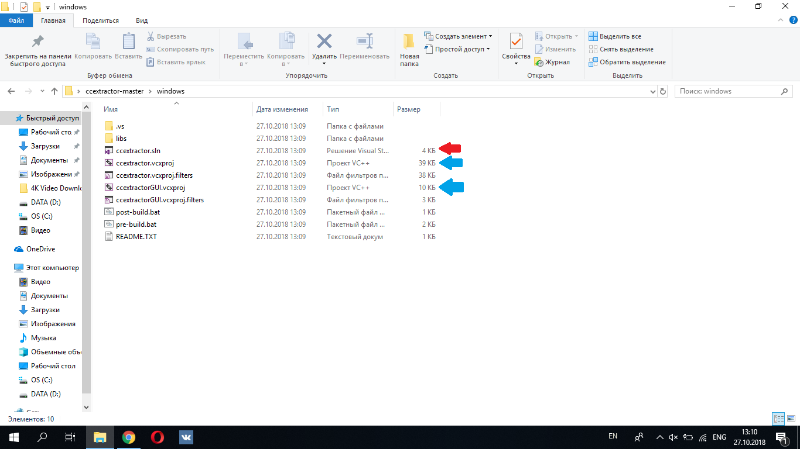

<h1>Compilation guide</h1>
<h4>*First of all you have to have your visual studio installed on your computer.</h4>

When you already have visual studio you have to download ccextractor code <a href="https://github.com/CCExtractor/ccextractor/">CCExtractor</a>

  

After downloading open your CCExtractor folder and then open windows folder.

 

Here you can see two files .vcxproj(marked with blue arrows) and one .sln project(marked with a red arrow)

 

You have to open .sln if you want to build both non Gui and Gui ccextractor or you can build them seperate opening .vcxproj files one by one.

